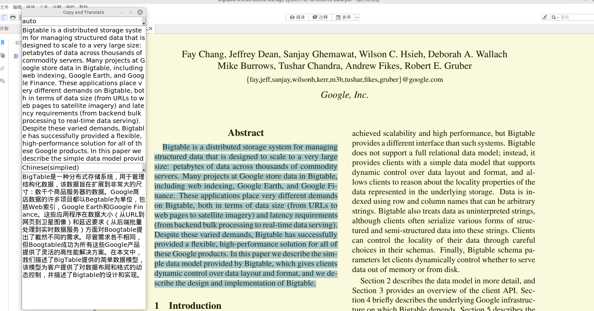

# Easytrans

It is an easy-to-use app which can translate selected text without copying manually.

## Environment

* python 3.10+, the newer the better
* **Linux** & **Windows**. **But this app is not fully tested on Windows. So I do not guarantee the correctness of it on Windows.**

## Depencies

### For Linux (Ubuntu)

* xclip
* tesseract ocr engine (**no data file need to be downloaded**. They are all in `tessdata/`)

```shell
sudo apt install xclip # xclip
sudo apt install tesseract-ocr # tesseract ocr engine
```

### For Windows

* tesseract ocr engine (**no data file need to be downloaded**. They are all in `tessdata/`)
  [Introduction | tessdoc](https://tesseract-ocr.github.io/tessdoc/Installation.html) Check this website and install the tessertact. Do not forget to set the **environment variable**.

### Requirements (Python external lib)

* requests
* pyperclip
* tkinter
* pynput
* langid
* googletrans>=4.0.0rc1
* httpcore
* winreg **(For Windows)**
* pytesseract
* tqdm

```shell
# For linux (Ubuntu)
sudo apt install python3-tk
pip install -r requirements_Linux.txt
```

```powershell
# For Windows
pip install -r requirements_Windows.txt
```

## Usage

**Please ensure that you can access the Google Translate website.**

### Text translation

Select text, press `F2`, then translation results will be shown.

Or just type sth. into the input textbox, press `Enter`, then translation results will be shown.



### Screenshot translation

press `F4`, select the screen area, then translation results will be shown. Auto source language is not supported here.

## Run

Directly run the `run.py`.

**Attention:**  if you **first** run the app, run `setup.py` first to **do some setups**， which will take some time.

## Settings

All Settings is in `settings.json`. Please **restart** the app if you change the file.

```json
{
    "request_url_for_baidu_api": "",

    "private_key": "",

    "appid": "",

    "engine": "google",

    "mode": "dark"

}
```

`"engine"` can be set as `"google"` or `"baidu_api"`. If it is set as `"baidu_api"`, `"request_url_for_baidu_api"`,   `"private_key"`and `"appid"` is required ( the corresponding website is https://api.fanyi.baidu.com/  ).

`"google"` engine (**default engine**) uses googletrans lib, so using it is totally free and no configuration is required.

`"mode"` can be set as `"dark"` or `"light"`.

## Language Support

* Chinese (simplified) 简体中文
* Chinese (traditional) 繁體中文
* English
* French Français
* Russian Русскийязык
* Japanese 日本語
* Korean 한국어

## Customize languages

If you want to add other languages, Please follow the following steps:

1. Find the `configs.json` file.
2. Focus on `"languages"`, `"languages_for_google"`, `"languages_for_baidu_api"`, `"languages_for_tessertact"`. If you never use baidu api, you can ignore `"languages_for_baidu_api"`. The last three kv pairs are perfectly matching with the first one. For example, `"Chinese (Simplified)"` in  `"languages"` <=> `"zh-cn"` in `"languages_for_google"`.
3. What you should do is to add sth and to keep the match. Add a language name in `"languages"`, and then add the corresponding language code referenced by [Googletrans: Free and Unlimited Google translate API for Python — Googletrans 3.0.0 documentation](https://py-googletrans.readthedocs.io/en/latest/) in `"languages_for_google"` at the same index. Samely, if you want to use baidu api, add the corresponding language code referenced by [百度翻译开放平台](https://api.fanyi.baidu.com/doc/21) in `"languages_for_baidu_api"` at the same index.  Last, add the corresponding language code in `"languages_for_tessertact"` at the same index, and **download** the corresponding data file to `tessdata/`, referenced by [Traineddata Files for Version 4.00 + | tessdoc](https://tesseract-ocr.github.io/tessdoc/Data-Files.html).
