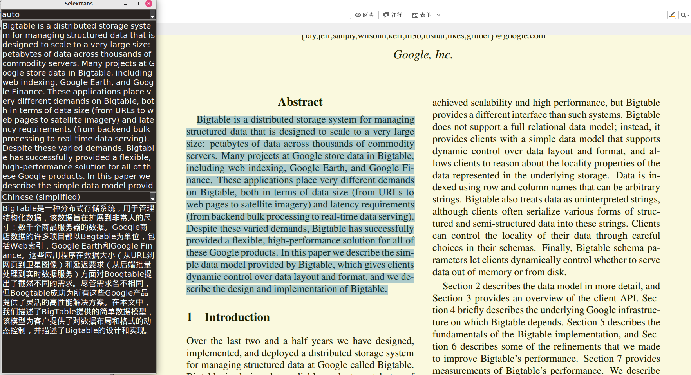

# Copy and Translate

It is a very simple app which copies and translates seleted text.

## Environment

* python3.0+, the newer the better
* **Linux** & **Windows**. It maybe can work on **Mac** but not be tested.

## Depencies

### For Linux (Ubuntu)

* xclip

```shell
sudo apt install xclip
```

### For Windows

None

### Python Libraries (Using pip or other package managers)

* hashlib
* requests
* secrets
* pyperclip
* tkinter 

```shell
sudo apt install python3-tk # For Linux (Ubuntu)
```

* pynput
* langid
* googletrans>=4.0.0rc1
* httpcore
* urllib
* winreg **(For Windows)**

## Basic Usage

**Please ensure that you can access the Google Translate website.**

Select text, press `F2`, then translation results will be shown.

Or just type sth. into the input textbox, press `Enter`, then translation results will be shown.



## Advanced Usage

Coming soon...

## Language Support

* Chinese(simplified) 简体中文

* Chinese(traditional) 繁體中文

* English

* French Français

* Russian Русскийязык

* Japanese 日本語

* Korean 한국어
